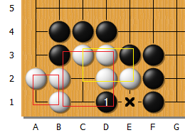
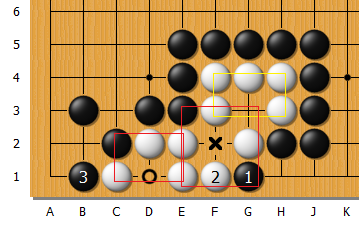

圍棋課-3

---

# 1. 覆盤

忘了~

---

# 2. 定石
## 2.1 星位定石-進三三定石  

註：(白)第13子記得放虎口，可以擴大地盤。

不同方向(旋轉90度)

## 2.2 星位定石-碰角定石-1 (取角)

## 2.3 星位定石-碰角定石-2 (取勢)

## 2.4. 星位定石-小飛掛

## 2.5 小目定石-1 (取角)

## 2.6. 小目定石-2 (取勢)

---

# 3.活棋-2個真眼

活棋 = 擁有兩個**真眼**

## ✅ 真眼的條件（每一個都要滿足）：

1. **眼點四周（上下左右）沒有空點，也不能是敵人**
    
    - 也就是**不能被靠近太多敵子**，否則對手有機會打入破眼。
        
2. **眼點四角（斜對角）最多只能有一個不是自己的棋子**
    
    - 若有兩個或以上敵棋，就可能是假眼了（尤其是角部或邊緣位置）。
        
3. **敵人若強行打入眼點，會立刻自殺**
    
    - 意思是：敵人下進去也沒有氣，不能逃，也不能做活。

檢查連在一起的兩個眼形：每一個眼形都需滿足「四周（上下左右）都是己棋或牆邊，最多只有一個角落不是自己的」，且兩眼必須彼此獨立、無法被同時破壞，才能構成活棋。

### 拆解來說更清楚：

#### 1. **每個眼形個別判斷**：

- 中央眼形：需**四邊都是自己或邊界**
    
- 邊上眼形：**三邊是自己或邊界**
    
- 角落眼形：只有兩邊 → 特別脆弱，要特別注意角上敵子！
    

#### 2. **角落判斷補充**：

- 每個眼的四個**斜角（角落）**，最多只能有**一個是敵子**，否則容易被破眼 → 即你說的「最多只能有一個不是自己的」，沒錯！
    

#### 3. **眼與眼要分離、不能重疊**

- 對手不能透過一手棋同時打入、破壞兩眼 → 若能，就不是活棋！

例圖-1：

若黑棋搶佔D1點，
白棋無法下來X處，右側白棋會全部被黑棋提走。
==>白棋無法再造成2個真眼。

例圖-2：

若黑棋搶佔G1點，
白棋只可能下再D2防守，
但黑棋可以再從B1攻擊，再逐漸攻擊D1、F2，則可以全吃。

