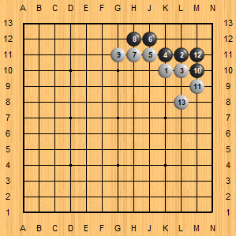
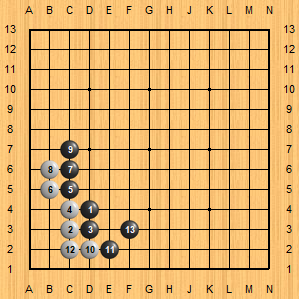
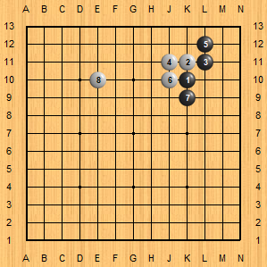
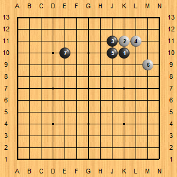
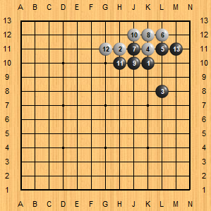
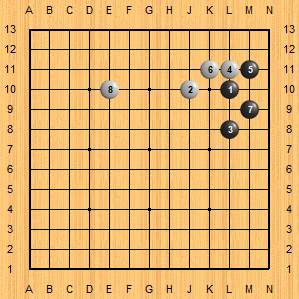
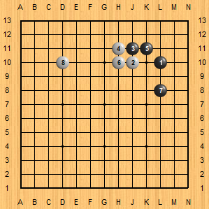

圍棋課-3

---

# 1. 覆盤

忘了~

---
# 2. 定石
## 2.1 星位定石-進三三定石  

註：(白)第13子記得放虎口，可以擴大地盤。

不同方向(旋轉90度)

## 2.2 星位定石-碰角定石-1 (取角)

## 2.3 星位定石-碰角定石-2 (取勢)

## 2.4. 星位定石-小飛掛

## 2.5 小目定石-1 (取角)

## 2.6. 小目定石-2 (取勢)

