圍棋課-4_20250714

---

# 1. 覆盤

## 1.1子力判斷

子力判斷包含幾個核心要素：  
實地 vs. 勢力 
這些棋子是圍出地了，還是只是影響力？  
是實際得分還是虛勢？  

### 效率高低  
這幾手棋是否必要？有沒有重複、浪費？  
同樣幾手棋，是不是可以做到更多？  

### 棋子是否活棋  
活棋才有價值，死棋就白下了。  
有沒有眼、有沒有逃出來？  

### 對整盤的貢獻  
是孤立還是連接大龍？  
有沒有支援別的戰線、牽制對方？  

### 對手是否輕鬆應對  
如果你下的子讓對方也輕鬆發展，那就沒子力價值。  

### 🧠 實戰常見的子力判斷情境：  
「我這邊有厚勢，但對手沒靠近，子力發揮不出來」→ 子力低效  
「他雖然有幾顆子在那，但都快死掉了」→ 子力低、甚至是負擔  
「我用幾手簡單的手法就把他圍死了」→ 對方子力判斷錯誤  

### 🗣 小結一句話：  
子力判斷 = 看這些子下得值不值，強不強，對整盤有沒有貢獻。


---
## 1.2 逢踢必立
- 圖示：
- 
```
  A B C D E F G
1 · · · · · · ·
2 · · · · · · ·
3 · · · · · · ·
4 · · · ● · · ·
5 · · ● · · · ·
6 · · ○ × · · ·
7 · · · · · · ·
```

個人補充：
- **通俗說法**：被尖（斜角壓迫）時，立一手穩形
- **棋形示意**：黑尖 C5 → 白立 D6
- **背後意義**：
    - 延氣保命
    - 避免被斷
    - 為後續連接與逃脫做準備
## 1.3 征子 ->引征
在征子的斜線路上3排內有對手的棋子，則為征子失敗；
若無，則為。

征子失敗： (被其他白棋接走)

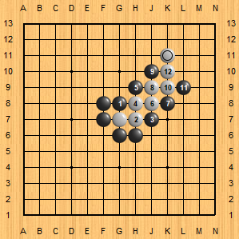

征子成功：

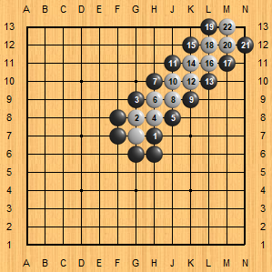


## 1.4 殺棋原則 ->縮小地盤
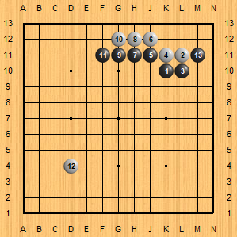

(黑)若要進攻時，以縮小對方的地盤為主。

## 1.5 角-活棋：4死6活5先手
### 4死
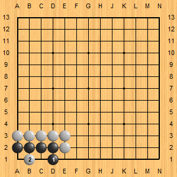

### 6活
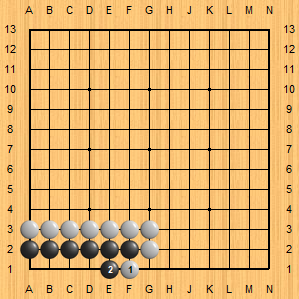

註：只要連續4個直式的眼，就可以活棋。

### 5先手
若防守方(黑)先，則防守方活棋
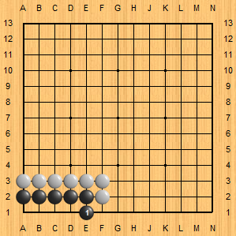

若進攻方先(白)，則防守方(黑)死棋
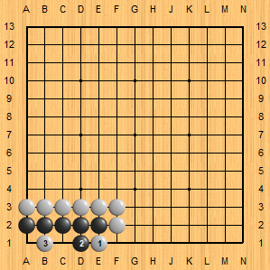
註：由於黑棋無法再做2眼，故全死。

## 1.6 邊-活棋：6死8活7先手
### 6死
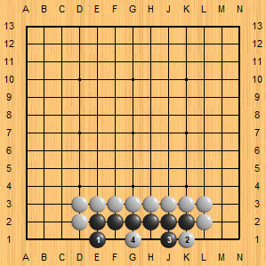
註：由於黑棋無法再做2眼，故全死。

### 8活
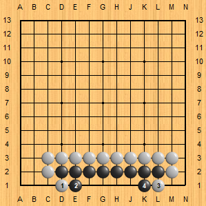

### 7先手
若防守方(黑)先，則防守方活棋
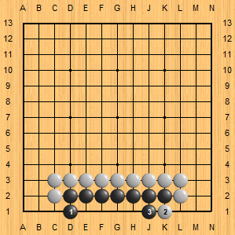

若進攻方先(白)，則防守方(黑)死棋
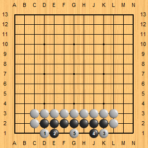
註：由於黑棋無法再做2眼，故全死。


## 1.7其他死活棋形
### 木梳6
-  0氣時，若白棋先下，則黑棋死。
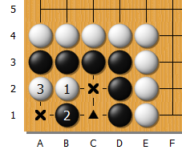
註：白棋要下在貼近黑棋的中間點。

-  1氣時，若白棋先下，打劫活。
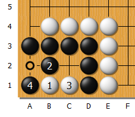
註1：白棋可先下在○(A2)點位後，提掉A1的黑子，
之後變黑白棋相爭A1點以取得此區塊。
註2：
由於黑棋外面有一氣，
所以黑棋造成無法用壓潰的方式殺掉裡面的白子，否則會被白子反殺，
所以黑棋只能造打劫的方式做法。

-  2氣時，則黑棋活。
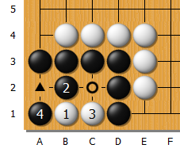
註：白棋下在A2後，提掉A1的黑子，
黑棋再下在C2點後位，白棋不可再下在裡面，
且黑棋有2眼，所以黑棋就可以用壓潰的方式，殺掉裡面的白棋。


### 地活
靠著圍出足夠空間，讓對手打不進來，達到活棋效果，即使不明顯有兩眼

### 眼活
擁有兩個真眼，是**最穩定、最乾淨的活法**。

### 雙活
你死我也死，所以誰也不能動 → 雙方**兩塊死棋互相依存，誰下誰死**，因此等於雙方都活。

### 打劫活
如上方，木梳六1氣時，雙方需爭搶眼位才能定出死活。


